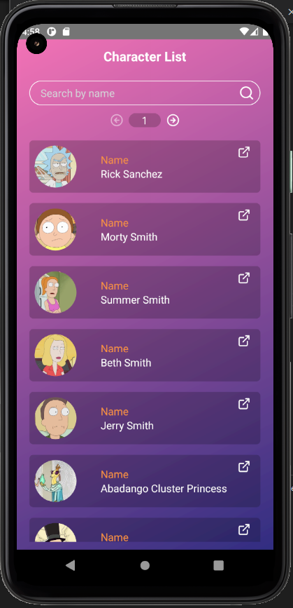
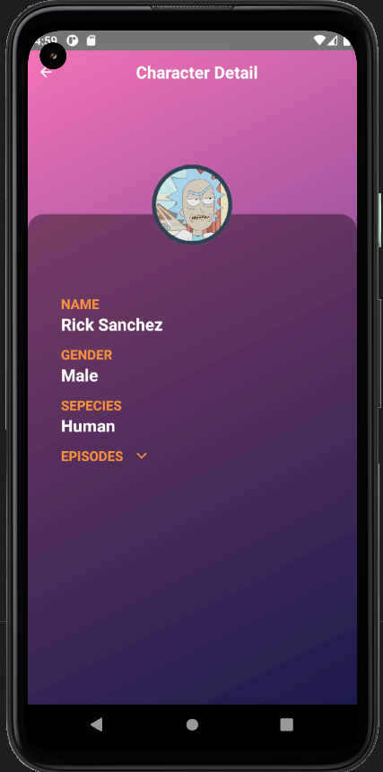
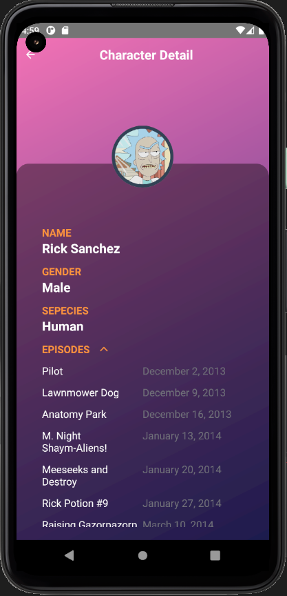
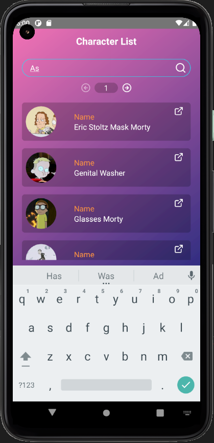
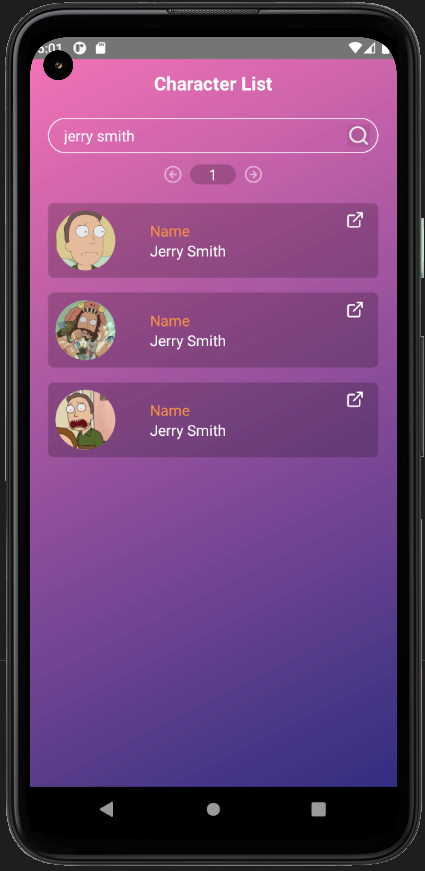

## Getting Started

First, install node modules

```bash
npm install
# or
yarn install
```

## Build Stack

- TypeScript.
- GraphQL (Apollo client).
- React navigation 5.
- Hooks.
- Integration testing is mandatory.
- React Native / React Hooks

## Features

- list of Rick and Morty characters.
- search functionality in which users can filter the characters' names. 
- Second screen that contains a character's details.
- Screen characters details should show the name, picture, species, gender and the list of episodes.

## ScreenShots





